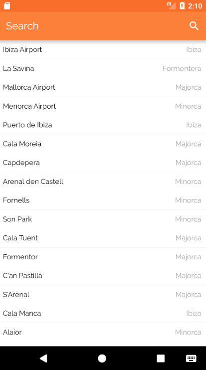

# react-native-js-material-searchbar

<p>


</p>

A React Native material search bar for Android that follows the Google's material design guidelines.
See more on: https://material.io/guidelines/patterns/search.html#search-in-app-search

<p align="center">

</p>

## Getting started

```sh
$ yarn add react-native-js-material-searchbar
```

## Usage

Code refers to the previous image example:

```js
// @flow */

import React from 'react'
import { AppRegistry, StyleSheet, View } from 'react-native'
import MaterialSearchBar from 'react-native-js-material-searchbar'
import MaterialIcons from 'react-native-vector-icons/MaterialIcons'

export default class Example extends React.PureComponent {
  _onTextDidChange = (text: string) => {
    console.log(text)
  }

  render() {
    return (
      <View style={styles.container}>
        <MaterialSearchBar
          onChangeText={this._onTextDidChange}
          containerStyle={styles.containerStyle}
          styleInput={styles.styleInput}
          placeholderTextColor={'white'}
          placeholder={I18n.t('Search')}
          searchIcon={<MaterialIcons name="search" size={24} color={'white'} />}
          closeIcon={<MaterialIcons name="close" size={24} color={'white'} />}
        />
      </View>
    )
  }
}

const styles = StyleSheet.create({
  containerStyle: {
    flexDirection: 'row',
    alignItems: 'center',
    backgroundColor: 'orange',
    elevation: 8,
    paddingHorizontal: 12
  },
  styleInput: {
    flex: 1,
    height: 56,
    color: 'white',
    fontSize: 20,
    fontFamily: 'Roboto'
  }
})
```

## API

|     Props      |     Type      |                                            Description                                             | Required |
| :------------: | :-----------: | :------------------------------------------------------------------------------------------------: | :------: |
| containerStyle |    Object     |                                                                                                    |    No    |
|   styleInput   |    Object     |                                  Inline-styles of the style input                                  |    No    |
|   searchIcon   | React.Element | The displayed search icon on the right of the text input. `react-native-vector-icons` is supported |    No    |
|   closeIcon    | React.Element | The displayed close icon on the right of the text input. `react-native-vector-icons` is supported  |    No    |
|  onChangeText  |   Function    |                          Function executed when field's value is changed                           |          |

## License

MIT License

Copyright (c) 2018 InterfaceKit

## Author

Antonio Moreno Valls `<amoreno at apsl.net>`

Built with 💛 by [APSL](https://github.com/apsl).
